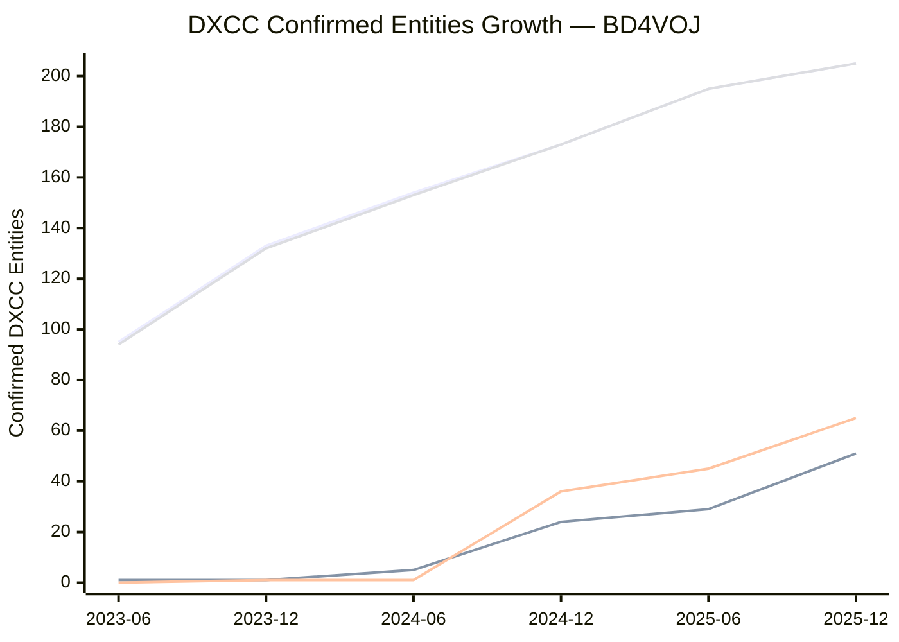

# DXCC Growth Over Time — BD4VOJ

The chart below shows how the number of confirmed DXCC entities grew over time, broken down by mode bucket.

**Legend:** Line 1 = Mixed (all modes), Line 2 = Phone, Line 3 = CW, Line 4 = Digital
