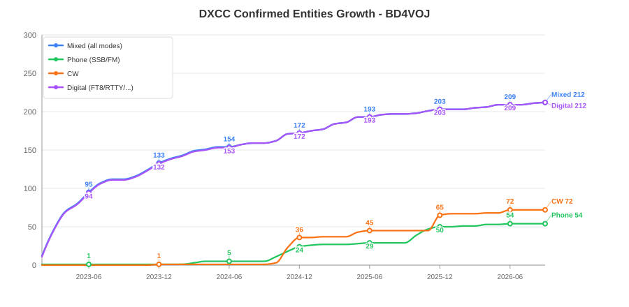
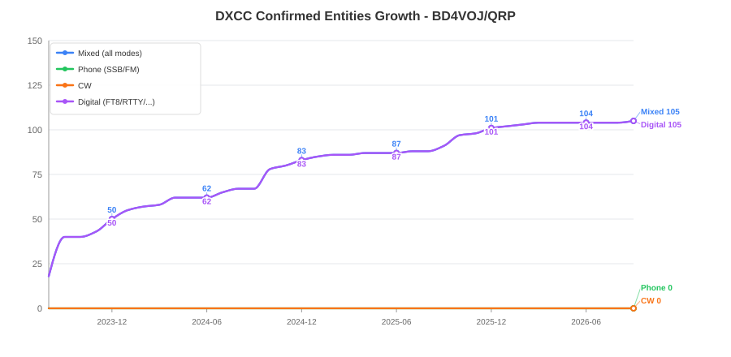

# DXCC Statistics Data

Last updated: Sat Sep  5 06:45:19 UTC 2026

## Files in this branch

- BD4VOJ/lotwDxccByBand.json
- BD4VOJ/lotwDxccGrowth.svg
- BD4VOJ/lotwDxccDetails.json
- BD4VOJ/lotwDxccGrowth.md
- BD4VOJ/lotwDxccByBand.md
- BD4VOJ/lotwDxccDetails.md
- BD4VOJ/lotwQso.adif
- BD4VOJ/lotwDxcc.json
- BD4VOJ_QRP/lotwDxccByBand.json
- BD4VOJ_QRP/lotwDxccGrowth.svg
- BD4VOJ_QRP/lotwDxccDetails.json
- BD4VOJ_QRP/lotwDxccGrowth.md
- BD4VOJ_QRP/lotwDxccByBand.md
- BD4VOJ_QRP/lotwDxccDetails.md
- BD4VOJ_QRP/lotwQso.adif
- BD4VOJ_QRP/lotwDxcc.json
- lotwQso.adif
- lotwDxcc.json

---

## DXCC Growth — BD4VOJ

---

## DXCC Growth — BD4VOJ_QRP

---

## DXCC by Band — BD4VOJ

See [lotwDxccByBand.md](./BD4VOJ/lotwDxccByBand.md) for full band-by-band DXCC details and Challenge score.

---

## DXCC by Band — BD4VOJ_QRP

See [lotwDxccByBand.md](./BD4VOJ_QRP/lotwDxccByBand.md) for full band-by-band DXCC details and Challenge score.

